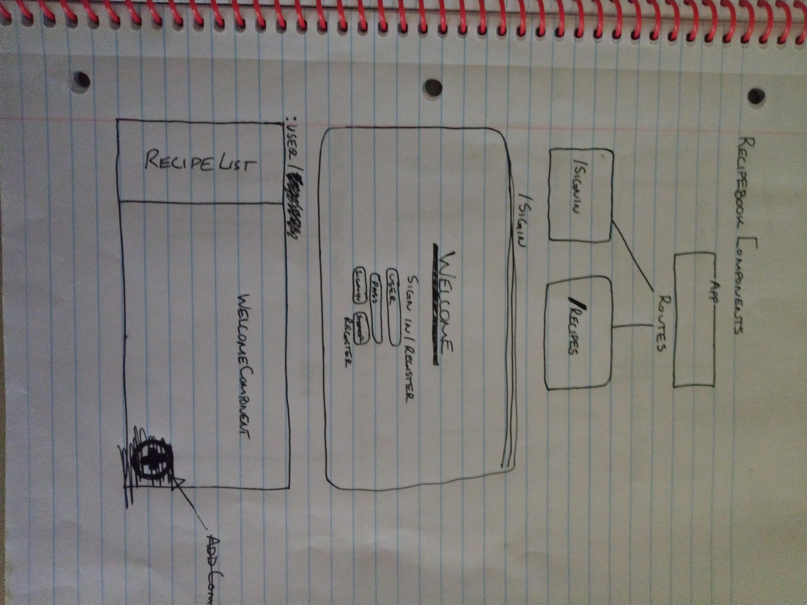
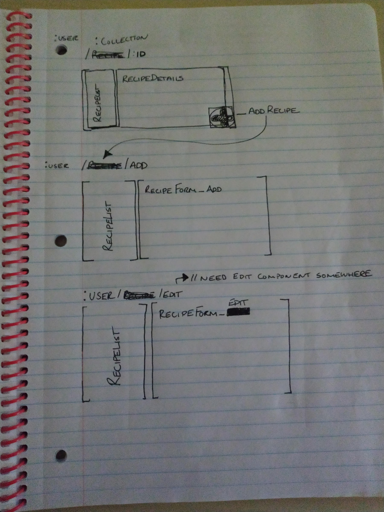
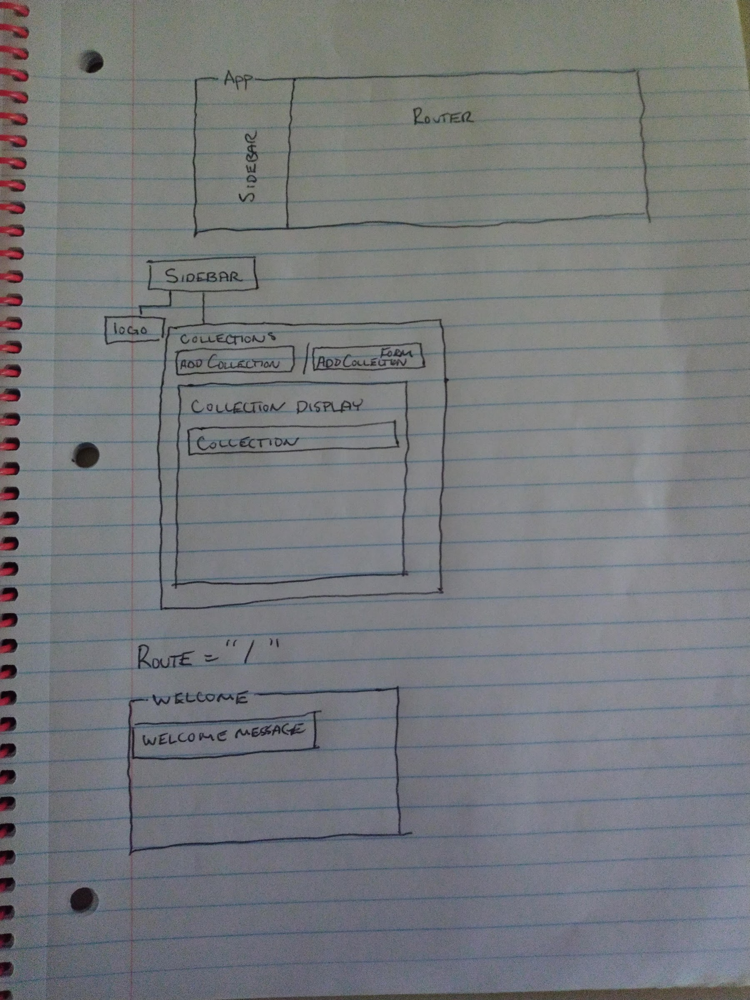

# PersonalCookbook

## Description - 
   Personal Cookbook App Designed to allow the user to create collections of person recipes

## Tecnologies Used -
   *Webpack
   *React
   *React-Router
   *StyleJSX
   
## Installation -
    1. Clone Repository https://github.com/wchamberlain89/PersonalCookbook.git
    2. Run "npm install" To install NPM package
    3. Run "npm run start" to start development server
    4. Navigate to LocalHost provided in terminal to view project
    
## Main Development -
    [] Greet user with welcome screen.
    [] Create new collections that store their own recipes.
    [] Display a list of recipes By picture and name by selecting a collection.
    [] Ability to add a new Recipe to a collection.
    [] View Page For the Individual Recipes.
    [] Edit Recipe Details from Recipe Component.
    
## Strech Goals
    [] Different templates for Recipe View
    [] Weekly meal Planner by adding Recipes

## Component Structure

